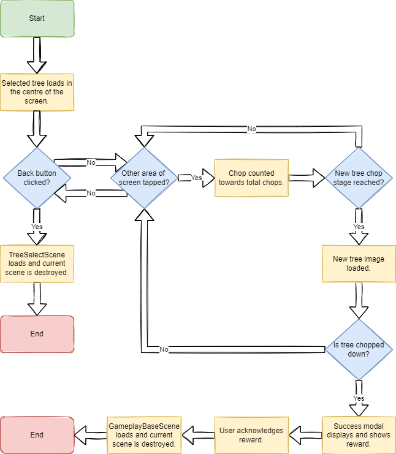
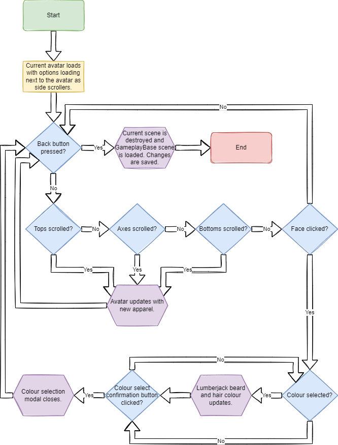

## Home Scene ##

### Purpose ###

The purpose of this scene is to serve as a starting point for the
application from where players can navigate to the different primary
areas of the game.

### Setting and Story ###

Within this scene, players will see the title of the game and buttons
for the primary functionality of the game. Buttons are yellow, and the
background is reminiscent of a forest, either with tree silhouettes or
evergreen-like colours. Tim the lumberjack may also appear in this
scene, either in silhouette or next to the menu buttons. The title
should appear at the top of the screen in block lettering, optionally
with an outline.

### Concept artwork ###

### Primary Action ###

Player selects Play from the menu.

### Exit Action ###

Player selects Exit from the menu or closes the application through the
mobile device OS close function.

### Flow Diagram ###

**UI Prototype**

## Gameplay Base Scene ##

### Purpose ###

### Setting and Story ###

### Concept artwork ###

### Primary Action ###

### Exit Action ###

### Flow Diagram ###

**UI Prototype**

## Tree Select Scene ##

### Purpose ###

### Setting and Story ###

### Concept artwork ###

### Primary Action ###

### Exit Action ###

### Flow Diagram ###

**UI Prototype**

## Tree Chopping Scene ##

### Purpose ###

### Setting and Story ###

### Concept artwork ###

### Primary Action ###

### Exit Action ###

### Flow Diagram ###

**UI Prototype**

## Store Scene ##

### Purpose ###

### Setting and Story ###

### Concept artwork ###

### Primary Action ###

### Exit Action ###

### Flow Diagram ###

**UI Prototype**

## Avatar Edit Scene ##

### Purpose ###

### Setting and Story ###

### Concept artwork ###

### Primary Action ###

### Exit Action ###

### Flow Diagram ###

**UI Prototype**

## Player Stat Scene ##

### Purpose ###

### Setting and Story ###

### Concept artwork ###

### Primary Action ###

### Exit Action ###

### Flow Diagram ###

**UI Prototype**

## Settings Scene ##

### Purpose ###

### Setting and Story ###

### Concept artwork ###

### Primary Action ###

### Exit Action ###

### Flow Diagram ###

**UI Prototype**

## Rest Scene ##

### Purpose ###

### Setting and Story ###

### Concept artwork ###

### Primary Action ###

### Exit Action ###

### Flow Diagram ###

**UI Prototype**

