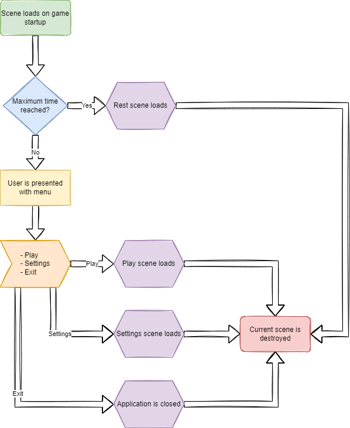
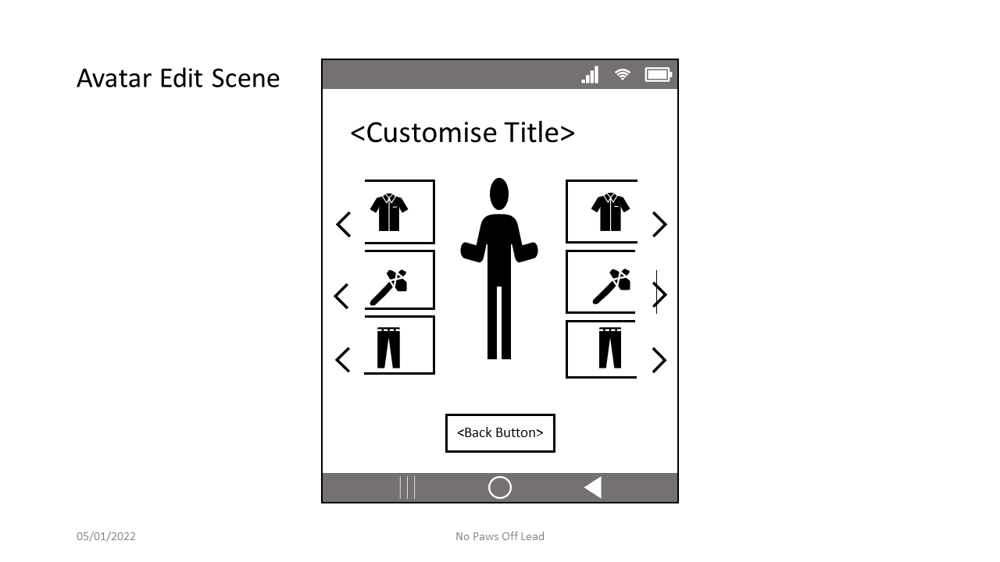

## Home Scene ##

### Purpose ###

The purpose of this scene is to serve as a starting point for the
application from where players can navigate to the different primary
areas of the game.

### Setting and Story ###

Within this scene, players will see the title of the game and buttons
for the primary functionality of the game. Buttons are yellow, and the
background is reminiscent of a forest, either with tree silhouettes or
evergreen-like colours. Tim the lumberjack may also appear in this
scene, either in silhouette or next to the menu buttons. The title
should appear at the top of the screen in block lettering, optionally
with an outline.

### Concept artwork ###

### Primary Action ###

Player selects Play from the menu.

### Exit Action ###

Player selects Exit from the menu or closes the application through the
mobile device OS close function.

### Flow Diagram ###

### UI Prototype ###

## Gameplay Base Scene ##

### Purpose ###

The purpose of this scene is to server as a branching point for any primary gameplay-related actions. Players can access the tree chopping functionality, store, avatar editing, or player skills.

### Setting and Story ###

The scene will feature greens and yellows similarly to the Home Scene. This will optionally include silhouettes for trees. Button animations may involve woodchips or sawdust.

### Concept artwork ###

### Primary Action ###

Players will primarily visit the Tree Select scene.

### Exit Action ###

Player selects the Back button or uses the back functionality within their phone's operating system. To close the application, players will need to return to the Home Scene or use the phone's application close functionality.

### Flow Diagram ###

### UI Prototype ###

## Tree Select Scene ##

### Purpose ###

The primary purpose of this scene is for players to select a tree to chop down.

### Setting and Story ###

Trees are found in horizontally scrollable list that provides a graphic for the tree. Trees are ordered in list of increased 'hardness':
  - Sapling
  - Dead tree
  - Pine
  - Chestnut
  - Elder
  - Birch
  - Oak
  - Ash
  - Blackwood
  - Rosewood
  - Ebony
  - Ironwood
  - Kingwood

### Concept artwork ###

### Primary Action ###

Players are intended to tap a tree to select it.

### Exit Action ###

Players can use the Back button or the OS back functionality. To quit the game, players can either close the application through the phone's OS or close the application from the Home Scene.

### Flow Diagram ###

### UI Prototype ###

#### Warning if another tree is already being chopped ####

## Tree Chopping Scene ##

### Purpose ###

Players can chop down trees in this scene by tapping the screen. This is the scene with the primary gameplay for the game.

### Setting and Story ###

A tree image will display in the middle of the screen, potentially with a sprite of the lumberjack next to the tree. The ground will be brown or yellow, and there will be a background with additional trees behind. When the player taps the screen, sawdust and wood chip particles will appear on the screen. A chopping clip will also play. The tree will be generated with a variable number of chops based on the tree's hardness. As the player taps the screen, the total number of chops will increase. At different stages, the tree's image will change to represent progress in cutting the tree down. After cutting the tree down, players are awarded currency. When reaching certain milestones, skill oints will be rewarded.  

### Concept artwork ###

### Primary Action ###

Tap the screen to chop the tree.

### Exit Action ###

Press the back button. To exit the game, players must back up to the Home Scene and press the close button, or use the phone's OS application close funtionality.

### Flow Diagram ###

**UI Prototype**

## Store Scene ##

### Purpose ###

Players can purchase goods to change the lumberjack's aesthetics or improve chopping capabilities (including additional lumberjacks to chop autonomously). 

### Setting and Story ###

The currency should have an older feel, something prior to the use of chainsaws.

### Concept artwork ###

### Primary Action ###

Tapping a good to purchase it.

### Exit Action ###

Press the back button. To exit the game, players must back up to the Home Scene and press the close button, or use the phone's OS application close funtionality.

### Flow Diagram ###

**UI Prototype**

## Avatar Edit Scene ##

### Purpose ###

### Setting and Story ###

### Concept artwork ###

### Primary Action ###

### Exit Action ###

Press the back button. To exit the game, players must back up to the Home Scene and press the close button, or use the phone's OS application close funtionality.

### Flow Diagram ###

**UI Prototype**

## Player Stat Scene ##

### Purpose ###

### Setting and Story ###

### Concept artwork ###

### Primary Action ###

### Exit Action ###

Press the back button. To exit the game, players must back up to the Home Scene and press the close button, or use the phone's OS application close funtionality.

### Flow Diagram ###

**UI Prototype**

## Settings Scene ##

### Purpose ###

### Setting and Story ###

### Concept artwork ###

### Primary Action ###

### Exit Action ###

Press the back button. To exit the game, players must back up to the Home Scene and press the close button, or use the phone's OS application close funtionality.

### Flow Diagram ###

**UI Prototype**

## Rest Scene ##

### Purpose ###

### Setting and Story ###

### Concept artwork ###

### Primary Action ###

### Exit Action ###

Wait for the next day to begin.

### Flow Diagram ###

**UI Prototype**

